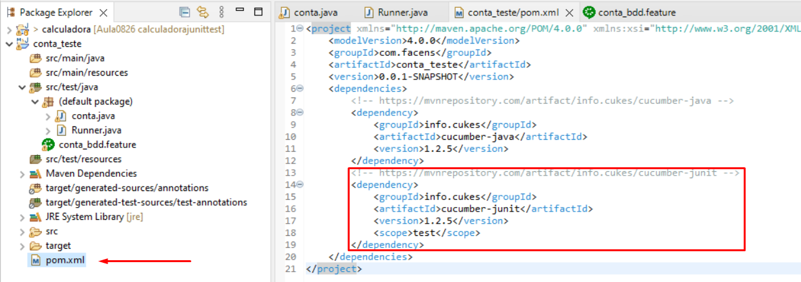
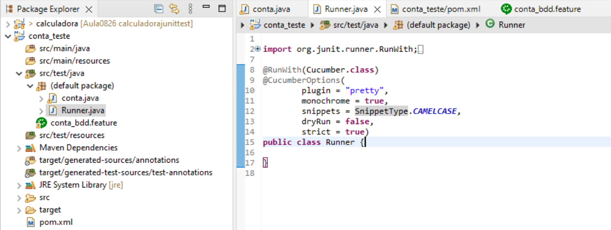
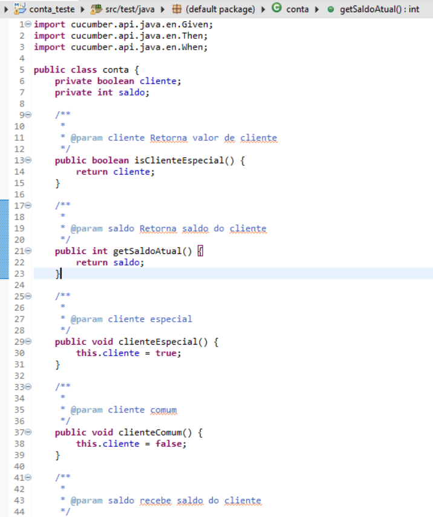
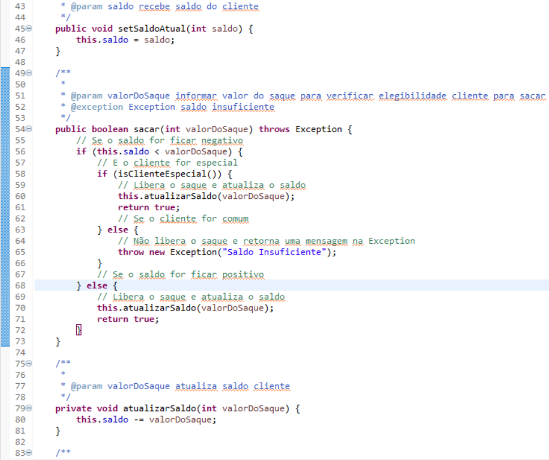
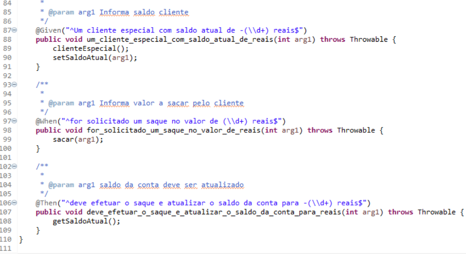

# Conta Teste (Cucumber) - Junit

## Descrição

Aplicação desenvolvida em JAVA para a criação de um cenario de teste Cucumber, explorando sua interface de criação de códigos e resultados.

### Pré requisitos

Antes de começar, você precisará das seguintes ferramentas instaladas: [git](https://git-scm.com/) e [JDK 8](https://www.oracle.com/br/java/technologies/javase/javase8-archive-downloads.html)
<br>
Editores de código [Eclipse](https://www.eclipse.org/downloads/) ou [Netbeans](https://netbeans.apache.org/download/nb14/nb14.html)

```

# clone o repositório
$ git clone https://github.com/LucasGPon/Conta_TesteCucumber.git
# acessar branch Junit
$ git checkout Junit

```
#### Alterações
Para reutilizar o código alterior, foi realizado as seguintes alterações:

1 - Implementado a dependência Junit e alterado a dependência Cucumber-Java no arquivo pom.xml



2 - Criado a classe Runner e implementado seus parâmetros



3 - Alterado o codigo da classe Conta





### Funcionamento

Após clonar o projeto e abri-lo com a IDE, basta acessar o caminho src/test/java e executar o arquivo Runner.
a solução do projeto se encontra no arquivo conta.java.

### Tecnologias

Para construir o projeto foi utilizado as seguintes ferramentas
- [Eclipse](https://www.eclipse.org/)
- [Java](https://www.java.com/pt-BR/)
- [Cucumber-Junit](https://mvnrepository.com/artifact/info.cukes/cucumber-junit/1.2.5)
- [Cucumber-Java](https://mvnrepository.com/artifact/info.cukes/cucumber-java/1.2.5)

### Autor

- Lucas Gaspar Ponciano